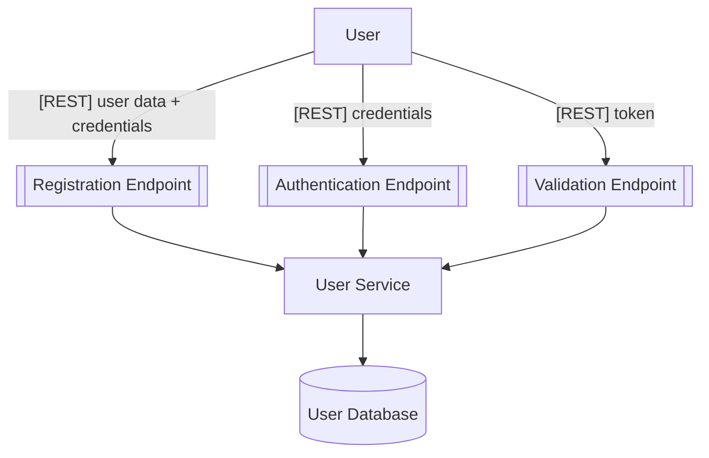

<p align="center">
<a href="https://codeclimate.com/github/thaua/user-service/maintainability"></a>
<a href="https://codeclimate.com/github/thaua/user-service/test_coverage"></a>
</p>

## Description

This is a generic application responsible for user domain responsibilities, such as signing up and signing in. 

## Requirements

- [Docker](https://www.docker.com/get-started)

## Development

We are using Docker with the [scripts-to-rule-them-all](https://github.com/github/scripts-to-rule-them-all) idea, so we
have a set of scripts inside `script` folder that should cover all development needs:

```bash
$ script/setup                # builds application
$ script/server               # runs application
$ script/update               # keeps application and its database schema up to date
$ script/test                 # run tests of the application
$ script/lint                 # runs lint tool on application
$ script/quality              # runs quality tool on application (CodeClimate)
$ script/bash                 # access bash into container
$ script/migration_reset      # reset schema and re-run migrations
$ script/migration_generate   # generate migrations
$ script/migration_run        # apply migrations
```

## Architecture

#### Application Flow (To-Be)



#### Application Layers (Path Organization)

- **core:** Domains and business logics decoupled from tools/frameworks.
- **infrastructure:** Infrastructure setup such as data providers, external connections and overall configuration.
- **presentation:** Entrypoint with routing, controllers and REST API framework.

## License

[](LICENSE)

## Stay in touch

For questions or inquiries, please contact **Thauã Silveira** at [thaua@outlook.com](mailto:thaua@outlook.com).
